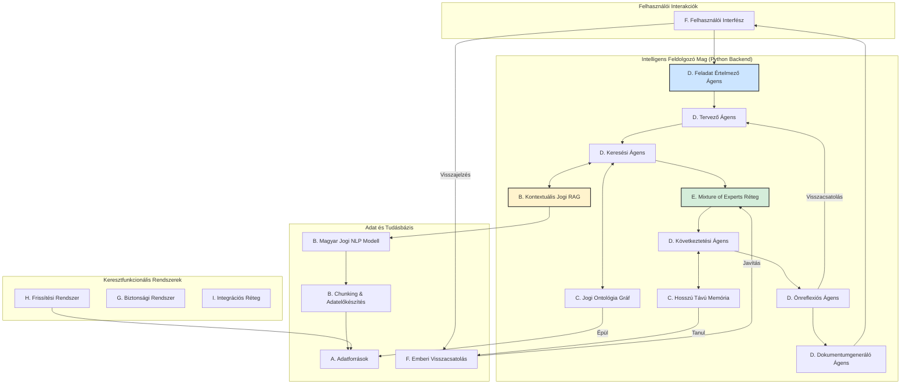
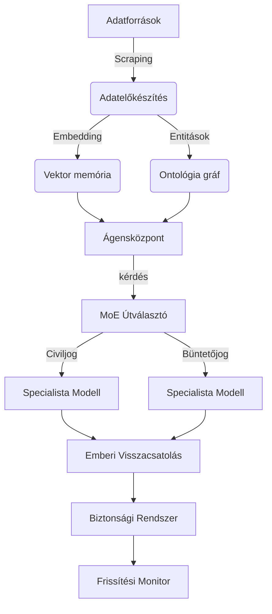

# Magyar Jogi AI Rendszer - Python Átállás: Terv és Backlog

**Verzió:** 1.0
**Dátum:** 2025. május 16.

Ez a dokumentum a Magyar Jogi AI Rendszer TypeScript-alapú prototípusáról a specifikációban részletezett, teljes funkcionalitású, Python-alapú enterprise architektúrára való átállás részletes tervét tartalmazza.

---

## **0. Lépés: Projekt Elágaztatása és Környezet Szétválasztása**

A fejlesztés megkezdése előtt elengedhetetlen a jelenlegi TypeScript projekt állapotának biztonságos archiválása és egy tiszta, izolált környezet létrehozása az új Python projekt számára.

**Cél:** A TypeScript kód megőrzése referenciaként, miközben a `main` branch a Python fejlesztés fő vonalává válik.

**Folyamat:**
1.  **TypeScript Archív Branch Létrehozása:**
    -   `git checkout -b typescript-archive`
    -   `git push origin typescript-archive`
    -   *Eredmény: A teljes jelenlegi kódbázis elmentve egy külön branch-re.*
2.  **Munkakönyvtárak Szétválasztása (manuális lépések):**
    -   Lépj ki a jelenlegi `CURSOR` (projekt) mappából.
    -   Nevezd át a mappát `energia-ai-typescript`-re.
    -   Klónozd újra a repository-t egy `energia-ai-python` nevű mappába: `git clone <repository_url> energia-ai-python`.
    -   Az új Python fejlesztést az `energia-ai-python` mappában végezd. A `main` branch itt már a Python kód otthona lesz.
3.  **Takarítás (opcionális):**
    -   Az `energia-ai-python` mappában töröld a TypeScript-specifikus fájlokat (`vite.config.ts`, `tailwind.config.js`, `src/`, stb.), hogy tiszta lappal indulhass.

---

## **1. Célkitűzés és Végleges Architektúra**

**Projekt víziója:** Egy olyan enterprise-szintű, Python-alapú, mikroszolgáltatási architektúrával rendelkező mesterséges intelligencia rendszer létrehozása, amely a megadott "Magyar Jogi Ágens Architektúra" specifikációnak megfelelően képes a magyar jogrendszert mélységében értelmezni, elemezni, és a jogi szakemberek munkáját autonóm ágensekkel és specializált szakértői modellekkel támogatni.

### **1.1. Architektúra Áttekintés (Célállapot)**
A rendszer a következő, logikailag elkülönülő rétegekből épül fel:

-   **A. Adatforrások Réteg:** Jogszabályok, bírósági határozatok, kommentárok gyűjtése.
-   **B. Adatelőkészítés Réteg:** Jogi NLP, chunking, kontextuális RAG.
-   **C. Integrált Memóriaréteg:** Rövid- és hosszú távú memória, jogi ontológia gráf.
-   **D. Ágensközpont:** Specializált, autonóm ágensek (tervező, kereső, következtető, stb.).
-   **E. Mixture of Experts (MoE) Réteg:** Jogterület-specifikus modellek.
-   **F. Emberi Visszacsatolási Réteg (RLHF):** Jogászi felügyelet és tanítás.
-   **G. Biztonsági Rendszer:** Etikai és adatvédelmi korlátok.
-   **H. Frissítési Rendszer:** Jogszabályváltozások automatikus követése.
-   **I. Integrációs Réteg:** Külső rendszerek (pl. Jogtár) és API-k.

### **1.2. Architektúra Vizuálisan**



---

## **2. Technológiai Stack (Célállapot)**

A specifikációnak megfelelően a következő technológiák kerülnek bevezetésre.

### **2.1. Backend**
-   **Programozási Nyelv:** Python 3.11+
-   **Web Keretrendszer:** FastAPI (aszinkron, nagy teljesítményű API-k)
-   **AI/ML Keretrendszerek:**
    -   **Alapmodellek:** PyTorch
    -   **NLP:** Hugging Face Transformers
    -   **Orchestration/RAG:** LangChain, LlamaIndex
    -   **Elosztott Számítás:** Ray
-   **Adatbázisok:**
    -   **Strukturált adatok:** PostgreSQL
    -   **Dokumentumtárolás:** MongoDB
    -   **Gráf (Ontológia):** Neo4j
    -   **Vektor Adatbázis:** Weaviate / Qdrant (ön-hosztolt) vagy Pinecone
    -   **Keresés:** Elasticsearch
    -   **Cache (Rövid távú memória):** Redis
-   **Mikroszolgáltatás Infrastruktúra:**
    -   **Konténerizáció:** Docker, Kubernetes
    -   **Kommunikáció:** gRPC
    -   **Üzenetsor:** RabbitMQ

### **2.2. Frontend**
-   **Keretrendszer:** React / Next.js (meglévő UI komponensek újrahasznosításával)
-   **Nyelv:** TypeScript
-   **API Kommunikáció:** GraphQL (Apollo Client) / tRPC

### **2.3. DevOps & Infrastruktúra**
-   **CI/CD:** GitHub Actions
-   **Infrastruktúra mint Kód (IaC):** Terraform
-   **Monitoring:** Prometheus + Grafana
-   **Deployment:** Helm (Kubernetes-re)

---

## **3. Fejlesztési Módszertan és Folyamatok**

-   **Módszertan:** Agilis (Scrum), 2 hetes sprintekkel.
-   **Folyamatok:**
    -   **CI/CD:** Minden `main` branch-re történő merge automatikusan futtatja a teszteket és telepíti a staging környezetbe.
    -   **Kódminőség:** Peer review (Pull Request) kötelező. Statikus analízis (pl. `ruff`, `mypy`) és tesztlefedettség mérése.
    -   **Tesztelés:** Többszintű tesztelési stratégia: unit, integrációs, és end-to-end tesztek. Különös hangsúly az AI-specifikus teszteken (hallucináció, jogi pontosság, stb.).

---

## **4. Részletes Fejlesztési Backlog**

A fejlesztés a specifikációban meghatározott 4 fő fázisban történik. Minden fázis önmagában is egy működő, de egyre komplexebb képességű terméket eredményez.

### **Fázis 1: Alapinfrastruktúra és Alapvető Jogszabályi Keresés (Hónap: 0-6)**
*Cél: Egy működő rendszer, ami képes a hatályos magyar jogszabályok keresésére, alap szintű értelmezésére és kivonatolására.*

#### **Epik: Projekt Alapok és Infrastruktúra (Sprint 0-1)**
-   [ ] Új Python projektstruktúra létrehozása (`pyproject.toml`, `src` mappa).
-   [ ] Docker és Docker Compose beállítása a lokális fejlesztéshez (Python, DB-k).
-   [ ] CI/CD pipeline alapok létrehozása (GitHub Actions): linter, type checker futtatása.
-   [ ] Terraform scriptek az alap infrastruktúrához (VPC, Kubernetes klaszter).
-   [ ] FastAPI alkalmazás vázának létrehozása, health check végponttal.

#### **Epik: Adatforrások és Adatelőkészítés Réteg (v1)**
-   [ ] **Adatgyűjtés:**
    -   [ ] **NJT Integráció (v1):** Adatgyűjtő modul fejlesztése a `njt.hu`-hoz. A modulnak a **European Legislation Identifier (ELI)** szabvány alapján kell programatikusan URL-eket generálnia a jogszabályok közvetlen eléréséhez, elkerülve a komplex, böngészőt szimuláló scrapinget.
    -   [ ] **Magyar Közlöny Monitorozás:** A `njt.hu`-n publikált Magyar Közlöny lapszámok figyelése az új jogszabályok azonosítására.
    -   [ ] ETL pipeline v1: letöltött jogszabályok (HTML) feldolgozása és strukturált tárolása.
-   [ ] **Adattárolás:**
    -   [ ] MongoDB séma tervezése a jogi dokumentumok és metaadataik tárolására.
    -   [ ] PostgreSQL séma a strukturált metaadatoknak (hatály, jogszabálytípus, stb.).
-   [ ] **Adatelőkészítés:**
    -   [ ] Alap chunking algoritmus implementálása Pythonban (bekezdés, szakasz alapú).
    -   [ ] Embedding generálás a chunk-okhoz (előtanított `huBERT`-alapú modellel).
    -   [ ] Vektor adatbázis (Weaviate/Qdrant) beállítása és az embeddingek betöltése.

#### **Epik: Ágensközpont és Keresés (v1)**
-   [ ] **Keresés:**
    -   [ ] Egyszerű szemantikus keresési végpont létrehozása (vektor DB alapján).
    -   [ ] Lexikális keresési végpont létrehozása (Elasticsearch alapján).
-   [ ] **Ágens Logika:**
    -   [ ] **Feladat Értelmező Ágens (v1):** Egyszerű NLU a keresési szándék felismerésére.
    -   [ ] **Keresési Ágens (v1):** A keresési végpontok meghívása és az eredmények összesítése.
-   [ ] **LLM Integráció:**
    -   [ ] OpenAI/Anthropic API kliens integrálása.
    -   [ ] **Dokumentumgeneráló Ágens (v1):** Keresési eredmények összefoglalása, jogszabály-kivonatok készítése prompt alapján.

#### **Epik: Felhasználói Felület (v1)**
-   [ ] React/Next.js frontend csatlakoztatása az új Python backendhez.
-   [ ] Kereső felület implementálása.
-   [ ] Eredmények (jogszabály-kivonatok) megjelenítése.
-   [ ] Alapvető magyar és angol nyelvi támogatás (i18n).

### **Fázis 2: Bővített Adatforrások és Haladó Keresés (Hónap: 6-12)**
*Cél: Bővített tudásbázis (bírósági határozatok), fejlettebb RAG, és egyszerűbb jogi dokumentumok generálása.*

#### **Epik: Adatforrások és Memória Réteg (v2)**
-   [ ] **Adatforrások:**
    -   [ ] Bírósági Határozatok Gyűjteményének integrálása (crawler + ETL).
    -   [ ] Licenszelt tartalmak API integrációja (pl. Jogtár).
-   [ ] **Memória:**
    -   [ ] **Rövid Távú Memória:** Redis integráció a beszélgetési kontextus tárolására.
    -   [ ] **Jogi Ontológia Gráf (v1):** Neo4j beállítása. ETL folyamat a jogszabályok közötti hivatkozások gráfba töltésére.

#### **Epik: Adatelőkészítés Réteg (v2)**
-   [ ] **NLP Modell:**
    -   [ ] `huBERT` modell finomhangolása magyar jogi szövegkorpuszon.
    -   [ ] Jogi entitás-felismerés (NER) implementálása (pl. §, bekezdés, hivatkozás).
-   [ ] **RAG Fejlesztés:**
    -   [ ] **Kontextuális Jogi RAG (v1):** Hibrid keresés implementálása (szemantikus + lexikális + gráf).
    -   [ ] Re-ranking algoritmus jogi relevancia alapján.

#### **Epik: Ágensközpont (v2)**
-   [ ] **Tervező Ágens (v1):** Egyszerű, több lépéses tervek generálása (pl. 1. keress jogszabályt, 2. keress kapcsolódó ítéletet, 3. foglald össze).
-   [ ] **Dokumentumgeneráló Ágens (v2):** Egyszerűbb szerződés és beadvány sablonok generálása.
-   [ ] Többnyelvű támogatás kiterjesztése az ágensek szintjén.

#### **Epik: Mixture of Experts (MoE) Réteg (v1)**
-   [ ] MoE routing mechanizmus vázának létrehozása.
-   [ ] Polgári jogi és büntetőjogi szakértő modellek (v1) helyének kialakítása (kezdetben általános LLM-ek specifikus promptokkal).

### **Fázis 3: Jogi Következtetés és Szakértői Rendszer (Hónap: 12-18)**
*Cél: Valódi jogi elemzésre és következtetésre képes rendszer, szakértői tudással és emberi visszacsatolással.*

#### **Epik: Memória és NLP (v3)**
-   [ ] **Hosszú Távú Memória:** Sikeres elemzések, Q&A párok archiválása és visszakereshetősége.
-   [ ] **Jogi Ontológia Gráf (v2):** Bővítés jogi fogalmakkal, precedens-kapcsolatokkal.
-   [ ] Hibrid memória (cloud/on-premise) telepítési modellek támogatása.
-   [ ] **Magyar Jogi NLP (v2):** Jogi érvelési minták azonosítása.

#### **Epik: Ágensközpont (v3)**
-   [ ] **Következtetési Ágens (v1):** Jogszabály-alkalmazás tényállásra, precedensek adaptálása. Chain-of-thought érvelés implementálása.
-   [ ] **Önreflexiós Ágens (v1):** A generált érvelés konzisztenciájának és forrásainak ellenőrzése.
-   [ ] **Tervező Ágens (v2):** Komplex, dinamikus feladat-gráfok generálása.

#### **Epik: Mixture of Experts (MoE) Réteg (v2)**
-   [ ] Teljes jogterületi szakértői modellcsomag (közig, EU, alkotmányjog).
-   [ ] Dinamikus, kontextus-alapú szakértő kiválasztás.

#### **Epik: Emberi Visszacsatolási Réteg (RLHF)**
-   [ ] **Jogászi Munkafelület:** Webes felület az AI által generált válaszok ellenőrzésére, javítására, annotálására.
-   [ ] **RLHF Pipeline (v1):** A visszajelzések gyűjtése, strukturálása és előkészítése a modellek finomhangolásához.

### **Fázis 4: Teljes Rendszer Optimalizálása és Finomhangolás (Hónap: 18-24)**
*Cél: Teljes funkcionalitású, optimalizált, önjavító, biztonságos és naprakész jogi AI rendszer.*

#### **Epik: Rendszer Optimalizálás**
-   [ ] Teljesítmény optimalizálás (válaszidő, erőforrás-használat).
-   [ ] Adatbázis-lekérdezések optimalizálása.
-   [ ] Modell-inferencia gyorsítása (pl. kvantizálás, ONNX).

#### **Epik: Funkció Bővítés**
-   [ ] Másodlagos és nemzetközi jogforrások teljes integrációja.
-   [ ] **Önreflexiós Ágens (v2):** Fejlett, automatikus hibajavítási képességek.
-   [ ] **RLHF (v2):** Teljesen automatizált modell újratanítási és A/B tesztelési ciklus.
-   [ ] Kollaboratív munkakörnyezet a jogászi felületen.

#### **Epik: Biztonság és Megfelelőség**
-   [ ] **Biztonsági Rendszer:** Teljes etikai és GDPR védőkorlátok implementálása, személyes adat maszkolása.
-   [ ] **Frissítési Rendszer:** Automatikus jogszabálykövető rendszer élesítése, amely riasztásokat küld és frissíti a tudásbázist.
    -   [ ] **Implementációs megjegyzés:** A rendszernek a `njt.hu` "időállapot" (time state) funkcionalitására kell épülnie a múltbeli, jelenlegi és jövőbeli jogszabályváltozások követéséhez.
-   [ ] **Integrációs Réteg:** Külső rendszerekkel (SZÜF, iManage) való integráció.
-   [ ] Nyilvános API réteg és fejlesztői SDK-k létrehozása.
-   [ ] Részletes jogosultságkezelés (RBAC) és multi-tenant architektúra.



# Példa szolgáltatás-indítás
docker compose up data-ingestion nlp-preprocessor knowledge-graph

project-root/
├── data-collector/
│   ├── Dockerfile
│   ├── requirements.txt
│   └── app.py
├── data-preprocessor/
│   ├── Dockerfile
│   ├── requirements.txt
│   └── app.py
... (similar for each microservice)
├── docker-compose.yml
└── .env

---

## **5. Magyar Jogi Adatforrások és Integrációs Stratégia**

### **5.1. Javasolt Magyar Jogi Adatforrások Prioritási Sorrendben**

**1. Prioritás: Hatályos Jogszabályok**
- **Forrás:** **Nemzeti Jogszabálytár (njt.hu)**
- **Integráció:**
  - **Javasolt stratégia:** A **European Legislation Identifier (ELI)** szabványra épülő, programatikusan generált URL-ek használata. Ez a megközelítés robusztus és megbízható adatgyűjtést tesz lehetővé a nyilvános felületről, és hatékonyabb, mint a hagyományos scraping.
  - **Vizsgálandó:** Hivatalos NJT API/webszolgáltatás elérése, amely teljesebb historikus adathozzáférést vagy garantált szolgáltatási szintet (SLA) biztosíthat.
- **Miért ez az első?** Minden jogi érvelés alapja a hatályos törvényi szöveg
- **Jogi domain:** Minden jogterületet lefed
- **Implementáció:**
  ```python
  # data-ingestion mikroszolgáltatás
  class NJTConnector:
      def __init__(self, api_key: str = None):
          self.api_key = api_key
          self.base_url = "https://njt.hu/api/v1/"
      
      async def fetch_legislation(self, query: str) -> List[LegalDocument]:
          # API vagy scraping logika
          pass
  ```

**2. Prioritás: Bírósági Gyakorlat (Precedensek)**
- **Forrás:** **Bírósági Határozatok Gyűjteménye (birosag.hu)**
- **Integráció:** Strukturált scraping a nyilvános keresőfelületről
- **Miért ez a második?** A jogszabályok gyakorlati értelmezését mutatja meg
- **Jogi domain:** Szűrhetően minden jogterület (polgári, büntető, közigazgatási)
- **Speciális fókusz:** Kúria eseti döntései (EBH) és kollégiumi vélemények

**3. Prioritás: Jogi Kommentárok és Irodalom**
- **Forrás:** **Wolters Kluwer (Jogtár)**
- **Integráció:** Kizárólag kereskedelmi API megállapodás alapján
- **Miért ez a harmadik?** Szakértői kommentárok mélyebb kontextust adnak
- **Jogi domain:** Specifikus jogterületekre lebontott elemzések

**4. Prioritás: EU Jog és Nemzetközi Források**
- **Forrás:** EUR-Lex, HUDOC (Emberi Jogok Európai Bírósága)
- **Integráció:** Nyilvános API-k használata
- **Miért fontos?** EU-konform értelmezés biztosítása

### **5.2. Felhőalapú és Konténerizált Architektúra Részletei**

**Fejlesztési Stratégia:**
```yaml
# docker-compose.dev.yml - Helyi fejlesztés
version: '3.8'
services:
  data-ingestion:
    build: ./services/data-ingestion
    environment:
      - NJT_API_KEY=${NJT_API_KEY}
      - MONGODB_URL=mongodb://mongo:27017
    depends_on:
      - mongo
      - redis
  
  nlp-preprocessor:
    build: ./services/nlp-preprocessor
    environment:
      - HUGGINGFACE_TOKEN=${HF_TOKEN}
      - WEAVIATE_URL=http://weaviate:8080
    volumes:
      - ./models:/app/models
    depends_on:
      - weaviate
  
  mongo:
    image: mongo:7
    volumes:
      - mongo_data:/data/db
  
  weaviate:
    image: semitechnologies/weaviate:1.22.4
    environment:
      - ENABLE_MODULES=text2vec-huggingface
```

**Javasolt Cloud Stack:**
- **Orchestráció:** 
  - **Kubernetes (AWS EKS, Azure AKS, Google GKE)** - maximális rugalmasság
  - **AWS Fargate / Google Cloud Run** - egyszerűbb üzemeltetés
- **Adatbázisok:**
  - **Vektor DB:** AWS OpenSearch / Pinecone / Weaviate Cloud
  - **Gráf DB:** Neo4j Aura (menedzselt)
  - **Relációs DB:** AWS RDS PostgreSQL / Azure Database
- **Aszinkron kommunikáció:** AWS SQS / Azure Service Bus / RabbitMQ

**Terraform példa (AWS):**
```hcl
# infrastructure/aws/main.tf
resource "aws_eks_cluster" "legal_ai" {
  name     = "legal-ai-cluster"
  role_arn = aws_iam_role.eks_cluster.arn
  version  = "1.28"

  vpc_config {
    subnet_ids = aws_subnet.private[*].id
  }
}

resource "aws_rds_instance" "postgres" {
  identifier = "legal-ai-postgres"
  engine     = "postgres"
  engine_version = "15.4"
  instance_class = "db.t3.medium"
  allocated_storage = 100
  storage_encrypted = true
}
```

### **5.3. Magyar Nyelvű AI Modellek Részletes Stratégiája**

**Alapmodell Réteg (Embedding és NLP):**
```python
# services/nlp-preprocessor/models.py
from transformers import AutoTokenizer, AutoModel
import torch

class HungarianLegalNLP:
    def __init__(self):
        # Elsődleges: SZTAKI-HLT huBERT
        self.tokenizer = AutoTokenizer.from_pretrained("SZTAKI-HLT/hubert-base-cc")
        self.model = AutoModel.from_pretrained("SZTAKI-HLT/hubert-base-cc")
        
        # Alternatíva: NYTK BERT
        # self.tokenizer = AutoTokenizer.from_pretrained("NYTK/text-bert-large-hungarian")
        # self.model = AutoModel.from_pretrained("NYTK/text-bert-large-hungarian")
    
    def create_embeddings(self, legal_text: str) -> torch.Tensor:
        inputs = self.tokenizer(legal_text, return_tensors="pt", 
                               max_length=512, truncation=True)
        with torch.no_grad():
            outputs = self.model(**inputs)
        return outputs.last_hidden_state.mean(dim=1)
    
    def fine_tune_on_legal_corpus(self, legal_documents: List[str]):
        # Jogi szövegkorpuszon való finomhangolás
        pass
```

**Generatív Modellek (Mixture of Experts):**
```python
# services/expert-router/moe_system.py
from transformers import AutoModelForCausalLM, AutoTokenizer

class LegalExpertRouter:
    def __init__(self):
        self.experts = {
            "civil_law": self._load_expert("civil"),
            "criminal_law": self._load_expert("criminal"),
            "administrative_law": self._load_expert("admin"),
            "constitutional_law": self._load_expert("constitutional")
        }
        self.classifier = self._load_domain_classifier()
    
    def _load_expert(self, domain: str):
        # Kezdetben: Mistral-7B finomhangolt változatok
        model_name = f"legal-ai-hun/{domain}-expert-v1"
        return {
            "tokenizer": AutoTokenizer.from_pretrained(model_name),
            "model": AutoModelForCausalLM.from_pretrained(model_name)
        }
    
    async def route_and_answer(self, question: str) -> str:
        domain = await self._classify_domain(question)
        expert = self.experts[domain]
        return await self._generate_answer(expert, question)
```

**Javasolt Modell Hierarchia:**
1. **Alapréteg:** `SZTAKI-HLT/hubert-base-cc` (embedding, NER)
2. **Generatív réteg:** `Mistral-7B-Instruct-v0.2` finomhangolva
3. **Specializált réteg:** Domain-specifikus expert modellek
4. **Jövőbeli cél:** `PULI-GPT` család integrálása (ha elérhető lesz)

**Finomhangolási Stratégia:**
```python
# training/fine_tune_legal.py
from transformers import Trainer, TrainingArguments

def fine_tune_legal_expert(base_model: str, legal_qa_dataset: Dataset):
    training_args = TrainingArguments(
        output_dir=f"./models/{base_model}-legal-hun",
        num_train_epochs=3,
        per_device_train_batch_size=4,
        gradient_accumulation_steps=4,
        warmup_steps=500,
        weight_decay=0.01,
        logging_dir='./logs',
        evaluation_strategy="steps",
        eval_steps=500,
        save_steps=1000,
        load_best_model_at_end=True,
    )
    
    trainer = Trainer(
        model=model,
        args=training_args,
        train_dataset=legal_qa_dataset["train"],
        eval_dataset=legal_qa_dataset["validation"],
        tokenizer=tokenizer,
    )
    
    trainer.train()
```

### **5.4. Implementációs Roadmap Frissítés**

**Fázis 1 kiegészítések:**
- [ ] **NJT API Connector:** Hivatalos API kapcsolat kiépítése vagy scraping implementálása
- [ ] **huBERT Integráció:** Magyar jogi embedding modell beállítása
- [ ] **Alapvető MoE Router:** Domain klasszifikáció implementálása

**Fázis 2 kiegészítések:**
- [ ] **Bírósági Határozatok Crawler:** birosag.hu strukturált feldolgozása
- [ ] **Jogtár API Integráció:** Kereskedelmi megállapodás és API implementáció
- [ ] **Finomhangolt Magyar Modellek:** Jogi korpuszon tanított specializált modellek

**Fázis 3-4 kiegészítések:**
- [ ] **Multi-Expert System:** Teljes jogterületi lefedettség
- [ ] **RLHF Magyar Kontextus:** Jogász visszajelzések magyar nyelvi sajátosságokkal
- [ ] **Hibrid Cloud Deployment:** On-premise és cloud közötti rugalmas átjárás

---

## **6. Következő Lépések és Döntési Pontok**

### **Azonnali Teendők:**
1. **NJT Kapcsolatfelvétel:** API hozzáférés tisztázása
2. **Jogtár Tárgyalások:** Kereskedelmi feltételek megismerése  
3. **huBERT Tesztelés:** Magyar jogi szövegeken való teljesítmény mérése
4. **Cloud Provider Kiválasztása:** AWS/Azure/GCP döntés infrastruktúra alapján

### **Kritikus Döntési Pontok:**
- **Adatvédelmi megfelelőség:** GDPR compliance minden adatforrásra
- **Licencelési stratégia:** Nyílt forráskódú vs. kereskedelmi modellek aránya
- **Skálázhatósági tervezés:** Kezdeti felhasználószám és növekedési projekció

from transformers import AutoTokenizer, AutoModel

tokenizer = AutoTokenizer.from_pretrained("SZTAKI-HLT/hubert-base-cc")
model = AutoModel.from_pretrained("SZTAKI-HLT/hubert-base-cc")

# Automatic context detection and switching
python .cursor/config-manager.py auto

# Manual context switching
python .cursor/config-manager.py switch --context ai-development

# Check current status
python .cursor/config-manager.py status

# Initialize complete environment
python .cursor/startup.py

---

## **7. Kritikus Akcióterv és Hiányosságok Pótlása**

A projekt alapjai (infrastruktúra, Docker) szilárdak, de a komponensek közötti integráció és a funkcionális logika hiányos. Az alábbi feladatok elvégzése kritikus a Phase 1 céljainak eléréséhez.

-   [ ] **CI/CD Pipeline Javítása Python Környezethez:**
    -   **Leírás:** A jelenlegi GitHub Actions (`.github/workflows/ci.yml`) a korábbi TypeScript projekthez van konfigurálva. Ezt frissíteni kell a Python-specifikus lépésekkel: `ruff` (linting), `mypy` (type checking), és `pytest` (tesztelés).
    -   **Függőség:** Task 3 (CI/CD) újbóli megnyitása és javítása.

-   [ ] **Adatbázisok Inicializálása és Séma Alkalmazása:**
    -   **Leírás:** A PostgreSQL és MongoDB konténerek futnak, de az adatbázis sémák nincsenek létrehozva és az alap adatok nincsenek betöltve. Alembic migrációkat kell futtatni a PostgreSQL-hez és a MongoDB séma validációt kell implementálni.
    -   **Függőség:** Task 4, 5 (DB Setup) kiegészítése.

-   [ ] **Crawler-ek Integrálása a Fő Alkalmazásba:**
    -   **Leírás:** Az `app/crawlers`-ben található `njt_crawler.py` és `magyar_kozlony_crawler.py` jelenleg nincsenek bekötve. FastAPI végpontokat kell létrehozni a futtatásukhoz, és az eredményeket a MongoDB-be kell menteniük.
    -   **Függőség:** Task 9, 10 (Crawlers) funkcionális bekötése.

-   [ ] **Alapvető Keresési Funkciók Implementálása:**
    -   **Leírás:** Létre kell hozni a hibrid keresési logikát. Egy API végpontot kell implementálni, ami a felhasználói kérést továbbítja az Elasticsearch (lexikális) és a Qdrant (szemantikus) felé, majd az eredményeket összefésüli.
    -   **Függőség:** Task 7, 8 (Vector/Lexical DB) és Task 15 (Search Agent) összekapcsolása.

-   [ ] **Task Understanding Agent Működőképessé Tétele:**
    -   **Leírás:** A `src/energia_ai/agents/task_understanding_agent.py` vázát fel kell tölteni logikával. Képesnek kell lennie a felhasználói inputot feldolgozni, a keresési szándékot felismerni és továbbítani a kérést a keresési ágensnek.
    -   **Függőség:** Task 14 (Task Understanding Agent) funkcionális implementálása.

from transformers import AutoTokenizer, AutoModel

tokenizer = AutoTokenizer.from_pretrained("SZTAKI-HLT/hubert-base-cc")
model = AutoModel.from_pretrained("SZTAKI-HLT/hubert-base-cc")

# Automatic context detection and switching
python .cursor/config-manager.py auto

# Manual context switching
python .cursor/config-manager.py switch --context ai-development

# Check current status
python .cursor/config-manager.py status

# Initialize complete environment
python .cursor/startup.py
