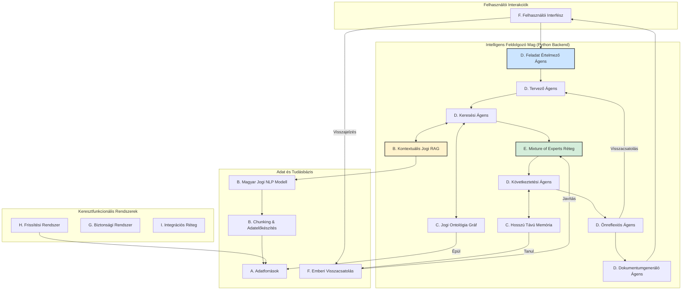

# Magyar Jogi AI Rendszer - Python Átállás: Terv és Backlog

**Verzió:** 1.0
**Dátum:** 2025. május 16.

Ez a dokumentum a Magyar Jogi AI Rendszer TypeScript-alapú prototípusáról a specifikációban részletezett, teljes funkcionalitású, Python-alapú enterprise architektúrára való átállás részletes tervét tartalmazza.

---

## **0. Lépés: Projekt Elágaztatása és Környezet Szétválasztása**

A fejlesztés megkezdése előtt elengedhetetlen a jelenlegi TypeScript projekt állapotának biztonságos archiválása és egy tiszta, izolált környezet létrehozása az új Python projekt számára.

**Cél:** A TypeScript kód megőrzése referenciaként, miközben a `main` branch a Python fejlesztés fő vonalává válik.

**Folyamat:**
1.  **TypeScript Archív Branch Létrehozása:**
    -   `git checkout -b typescript-archive`
    -   `git push origin typescript-archive`
    -   *Eredmény: A teljes jelenlegi kódbázis elmentve egy külön branch-re.*
2.  **Munkakönyvtárak Szétválasztása (manuális lépések):**
    -   Lépj ki a jelenlegi `CURSOR` (projekt) mappából.
    -   Nevezd át a mappát `energia-ai-typescript`-re.
    -   Klónozd újra a repository-t egy `energia-ai-python` nevű mappába: `git clone <repository_url> energia-ai-python`.
    -   Az új Python fejlesztést az `energia-ai-python` mappában végezd. A `main` branch itt már a Python kód otthona lesz.
3.  **Takarítás (opcionális):**
    -   Az `energia-ai-python` mappában töröld a TypeScript-specifikus fájlokat (`vite.config.ts`, `tailwind.config.js`, `src/`, stb.), hogy tiszta lappal indulhass.

---

## **1. Célkitűzés és Végleges Architektúra**

**Projekt víziója:** Egy olyan enterprise-szintű, Python-alapú, mikroszolgáltatási architektúrával rendelkező mesterséges intelligencia rendszer létrehozása, amely a megadott "Magyar Jogi Ágens Architektúra" specifikációnak megfelelően képes a magyar jogrendszert mélységében értelmezni, elemezni, és a jogi szakemberek munkáját autonóm ágensekkel és specializált szakértői modellekkel támogatni.

### **1.1. Architektúra Áttekintés (Célállapot)**
A rendszer a következő, logikailag elkülönülő rétegekből épül fel:

-   **A. Adatforrások Réteg:** Jogszabályok, bírósági határozatok, kommentárok gyűjtése.
-   **B. Adatelőkészítés Réteg:** Jogi NLP, chunking, kontextuális RAG.
-   **C. Integrált Memóriaréteg:** Rövid- és hosszú távú memória, jogi ontológia gráf.
-   **D. Ágensközpont:** Specializált, autonóm ágensek (tervező, kereső, következtető, stb.).
-   **E. Mixture of Experts (MoE) Réteg:** Jogterület-specifikus modellek.
-   **F. Emberi Visszacsatolási Réteg (RLHF):** Jogászi felügyelet és tanítás.
-   **G. Biztonsági Rendszer:** Etikai és adatvédelmi korlátok.
-   **H. Frissítési Rendszer:** Jogszabályváltozások automatikus követése.
-   **I. Integrációs Réteg:** Külső rendszerek (pl. Jogtár) és API-k.

### **1.2. Architektúra Vizuálisan**

---

## **2. Technológiai Stack (Célállapot)**

A specifikációnak megfelelően a következő technológiák kerülnek bevezetésre.

### **2.1. Backend**
-   **Programozási Nyelv:** Python 3.11+
-   **Web Keretrendszer:** FastAPI (aszinkron, nagy teljesítményű API-k)
-   **AI/ML Keretrendszerek:**
    -   **Alapmodellek:** PyTorch
    -   **NLP:** Hugging Face Transformers
    -   **Orchestration/RAG:** LangChain, LlamaIndex
    -   **Elosztott Számítás:** Ray
-   **Adatbázisok:**
    -   **Strukturált adatok:** PostgreSQL
    -   **Dokumentumtárolás:** MongoDB
    -   **Gráf (Ontológia):** Neo4j
    -   **Vektor Adatbázis:** Weaviate / Qdrant (ön-hosztolt) vagy Pinecone
    -   **Keresés:** Elasticsearch
    -   **Cache (Rövid távú memória):** Redis
-   **Mikroszolgáltatás Infrastruktúra:**
    -   **Konténerizáció:** Docker, Kubernetes
    -   **Kommunikáció:** gRPC
    -   **Üzenetsor:** RabbitMQ

### **2.2. Frontend**
-   **Keretrendszer:** React / Next.js (meglévő UI komponensek újrahasznosításával)
-   **Nyelv:** TypeScript
-   **API Kommunikáció:** GraphQL (Apollo Client) / tRPC

### **2.3. DevOps & Infrastruktúra**
-   **CI/CD:** GitHub Actions
-   **Infrastruktúra mint Kód (IaC):** Terraform
-   **Monitoring:** Prometheus + Grafana
-   **Deployment:** Helm (Kubernetes-re)

---

## **3. Fejlesztési Módszertan és Folyamatok**

-   **Módszertan:** Agilis (Scrum), 2 hetes sprintekkel.
-   **Folyamatok:**
    -   **CI/CD:** Minden `main` branch-re történő merge automatikusan futtatja a teszteket és telepíti a staging környezetbe.
    -   **Kódminőség:** Peer review (Pull Request) kötelező. Statikus analízis (pl. `ruff`, `mypy`) és tesztlefedettség mérése.
    -   **Tesztelés:** Többszintű tesztelési stratégia: unit, integrációs, és end-to-end tesztek. Különös hangsúly az AI-specifikus teszteken (hallucináció, jogi pontosság, stb.).

---

## **4. Részletes Fejlesztési Backlog**

A fejlesztés a specifikációban meghatározott 4 fő fázisban történik. Minden fázis önmagában is egy működő, de egyre komplexebb képességű terméket eredményez.

### **Fázis 1: Alapinfrastruktúra és Alapvető Jogszabályi Keresés (Hónap: 0-6)**
*Cél: Egy működő rendszer, ami képes a hatályos magyar jogszabályok keresésére, alap szintű értelmezésére és kivonatolására.*

#### **Epik: Projekt Alapok és Infrastruktúra (Sprint 0-1)**
-   [ ] Új Python projektstruktúra létrehozása (`pyproject.toml`, `src` mappa).
-   [ ] Docker és Docker Compose beállítása a lokális fejlesztéshez (Python, DB-k).
-   [ ] CI/CD pipeline alapok létrehozása (GitHub Actions): linter, type checker futtatása.
-   [ ] Terraform scriptek az alap infrastruktúrához (VPC, Kubernetes klaszter).
-   [ ] FastAPI alkalmazás vázának létrehozása, health check végponttal.

#### **Epik: Adatforrások és Adatelőkészítés Réteg (v1)**
-   [ ] **Adatgyűjtés:**
    -   [ ] Web crawler fejlesztése a Magyar Közlöny és a Wolters Kluwer forrásaihoz.
    -   [ ] ETL pipeline v1: letöltött jogszabályok (XML/HTML) feldolgozása és strukturált tárolása.
-   [ ] **Adattárolás:**
    -   [ ] MongoDB séma tervezése a jogi dokumentumok és metaadataik tárolására.
    -   [ ] PostgreSQL séma a strukturált metaadatoknak (hatály, jogszabálytípus, stb.).
-   [ ] **Adatelőkészítés:**
    -   [ ] Alap chunking algoritmus implementálása Pythonban (bekezdés, szakasz alapú).
    -   [ ] Embedding generálás a chunk-okhoz (előtanított `huBERT`-alapú modellel).
    -   [ ] Vektor adatbázis (Weaviate/Qdrant) beállítása és az embeddingek betöltése.

#### **Epik: Ágensközpont és Keresés (v1)**
-   [ ] **Keresés:**
    -   [ ] Egyszerű szemantikus keresési végpont létrehozása (vektor DB alapján).
    -   [ ] Lexikális keresési végpont létrehozása (Elasticsearch alapján).
-   [ ] **Ágens Logika:**
    -   [ ] **Feladat Értelmező Ágens (v1):** Egyszerű NLU a keresési szándék felismerésére.
    -   [ ] **Keresési Ágens (v1):** A keresési végpontok meghívása és az eredmények összesítése.
-   [ ] **LLM Integráció:**
    -   [ ] OpenAI/Anthropic API kliens integrálása.
    -   [ ] **Dokumentumgeneráló Ágens (v1):** Keresési eredmények összefoglalása, jogszabály-kivonatok készítése prompt alapján.

#### **Epik: Felhasználói Felület (v1)**
-   [ ] React/Next.js frontend csatlakoztatása az új Python backendhez.
-   [ ] Kereső felület implementálása.
-   [ ] Eredmények (jogszabály-kivonatok) megjelenítése.
-   [ ] Alapvető magyar és angol nyelvi támogatás (i18n).

### **Fázis 2: Bővített Adatforrások és Haladó Keresés (Hónap: 6-12)**
*Cél: Bővített tudásbázis (bírósági határozatok), fejlettebb RAG, és egyszerűbb jogi dokumentumok generálása.*

#### **Epik: Adatforrások és Memória Réteg (v2)**
-   [ ] **Adatforrások:**
    -   [ ] Bírósági Határozatok Gyűjteményének integrálása (crawler + ETL).
    -   [ ] Licenszelt tartalmak API integrációja (pl. Jogtár).
-   [ ] **Memória:**
    -   [ ] **Rövid Távú Memória:** Redis integráció a beszélgetési kontextus tárolására.
    -   [ ] **Jogi Ontológia Gráf (v1):** Neo4j beállítása. ETL folyamat a jogszabályok közötti hivatkozások gráfba töltésére.

#### **Epik: Adatelőkészítés Réteg (v2)**
-   [ ] **NLP Modell:**
    -   [ ] `huBERT` modell finomhangolása magyar jogi szövegkorpuszon.
    -   [ ] Jogi entitás-felismerés (NER) implementálása (pl. §, bekezdés, hivatkozás).
-   [ ] **RAG Fejlesztés:**
    -   [ ] **Kontextuális Jogi RAG (v1):** Hibrid keresés implementálása (szemantikus + lexikális + gráf).
    -   [ ] Re-ranking algoritmus jogi relevancia alapján.

#### **Epik: Ágensközpont (v2)**
-   [ ] **Tervező Ágens (v1):** Egyszerű, több lépéses tervek generálása (pl. 1. keress jogszabályt, 2. keress kapcsolódó ítéletet, 3. foglald össze).
-   [ ] **Dokumentumgeneráló Ágens (v2):** Egyszerűbb szerződés és beadvány sablonok generálása.
-   [ ] Többnyelvű támogatás kiterjesztése az ágensek szintjén.

#### **Epik: Mixture of Experts (MoE) Réteg (v1)**
-   [ ] MoE routing mechanizmus vázának létrehozása.
-   [ ] Polgári jogi és büntetőjogi szakértő modellek (v1) helyének kialakítása (kezdetben általános LLM-ek specifikus promptokkal).

### **Fázis 3: Jogi Következtetés és Szakértői Rendszer (Hónap: 12-18)**
*Cél: Valódi jogi elemzésre és következtetésre képes rendszer, szakértői tudással és emberi visszacsatolással.*

#### **Epik: Memória és NLP (v3)**
-   [ ] **Hosszú Távú Memória:** Sikeres elemzések, Q&A párok archiválása és visszakereshetősége.
-   [ ] **Jogi Ontológia Gráf (v2):** Bővítés jogi fogalmakkal, precedens-kapcsolatokkal.
-   [ ] Hibrid memória (cloud/on-premise) telepítési modellek támogatása.
-   [ ] **Magyar Jogi NLP (v2):** Jogi érvelési minták azonosítása.

#### **Epik: Ágensközpont (v3)**
-   [ ] **Következtetési Ágens (v1):** Jogszabály-alkalmazás tényállásra, precedensek adaptálása. Chain-of-thought érvelés implementálása.
-   [ ] **Önreflexiós Ágens (v1):** A generált érvelés konzisztenciájának és forrásainak ellenőrzése.
-   [ ] **Tervező Ágens (v2):** Komplex, dinamikus feladat-gráfok generálása.

#### **Epik: Mixture of Experts (MoE) Réteg (v2)**
-   [ ] Teljes jogterületi szakértői modellcsomag (közig, EU, alkotmányjog).
-   [ ] Dinamikus, kontextus-alapú szakértő kiválasztás.

#### **Epik: Emberi Visszacsatolási Réteg (RLHF)**
-   [ ] **Jogászi Munkafelület:** Webes felület az AI által generált válaszok ellenőrzésére, javítására, annotálására.
-   [ ] **RLHF Pipeline (v1):** A visszajelzések gyűjtése, strukturálása és előkészítése a modellek finomhangolásához.

### **Fázis 4: Teljes Rendszer Optimalizálása és Finomhangolás (Hónap: 18-24)**
*Cél: Teljes funkcionalitású, optimalizált, önjavító, biztonságos és naprakész jogi AI rendszer.*

#### **Epik: Rendszer Optimalizálás**
-   [ ] Teljesítmény optimalizálás (válaszidő, erőforrás-használat).
-   [ ] Adatbázis-lekérdezések optimalizálása.
-   [ ] Modell-inferencia gyorsítása (pl. kvantizálás, ONNX).

#### **Epik: Funkció Bővítés**
-   [ ] Másodlagos és nemzetközi jogforrások teljes integrációja.
-   [ ] **Önreflexiós Ágens (v2):** Fejlett, automatikus hibajavítási képességek.
-   [ ] **RLHF (v2):** Teljesen automatizált modell újratanítási és A/B tesztelési ciklus.
-   [ ] Kollaboratív munkakörnyezet a jogászi felületen.

#### **Epik: Biztonság és Megfelelőség**
-   [ ] **Biztonsági Rendszer:** Teljes etikai és GDPR védőkorlátok implementálása, személyes adat maszkolása.
-   [ ] **Frissítési Rendszer:** Automatikus jogszabálykövető rendszer élesítése, amely riasztásokat küld és frissíti a tudásbázist.
-   [ ] **Integrációs Réteg:** Külső rendszerekkel (SZÜF, iManage) való integráció.
-   [ ] Nyilvános API réteg és fejlesztői SDK-k létrehozása.
-   [ ] Részletes jogosultságkezelés (RBAC) és multi-tenant architektúra.
