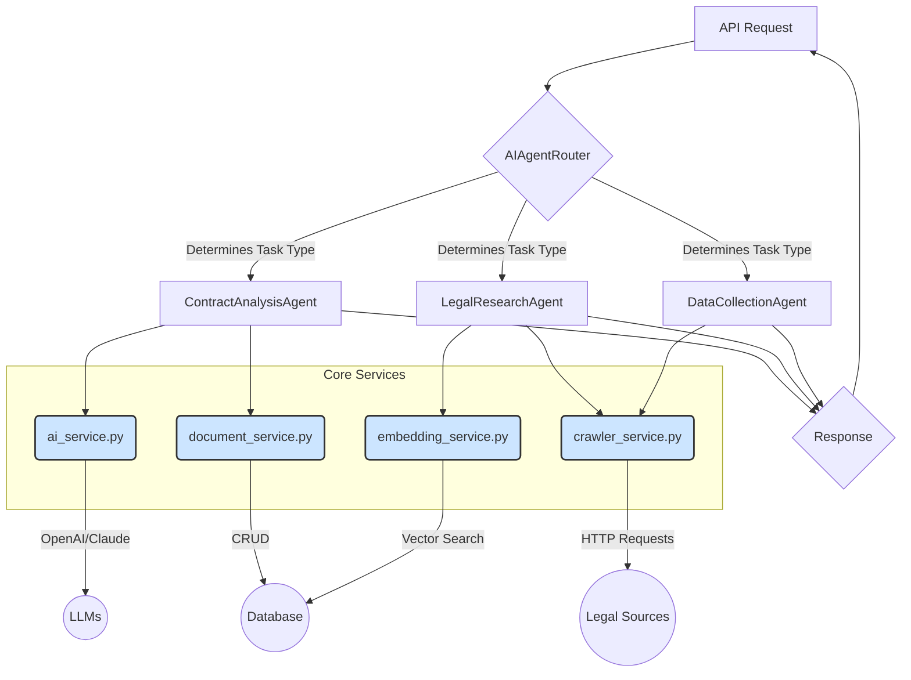
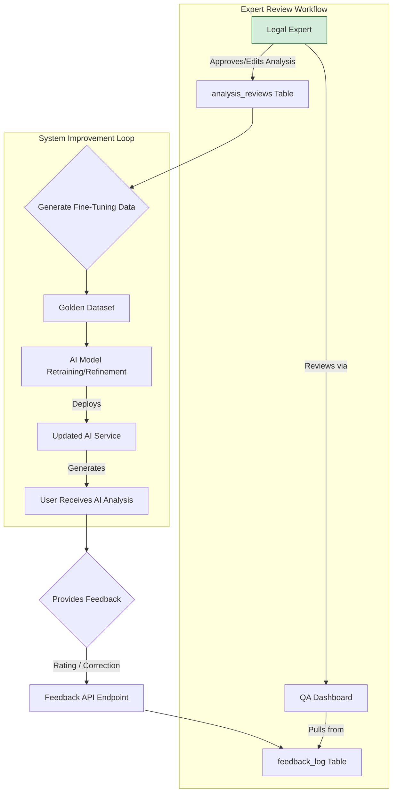

# AI Agent Architecture - Python Backend

This document details the design of the multi-agent AI system for the Energia Legal AI platform, built entirely in Python. The architecture emphasizes modularity, specialization, and scalability.

## 🏗️ Core Principles

1.  **Specialization**: Each agent has a single, well-defined responsibility (e.g., contract analysis, legal research).
2.  **Modularity**: Agents are self-contained Python classes, making them easy to test, maintain, and upgrade.
3.  **Orchestration**: A central `AIAgentRouter` orchestrates the flow of requests to the appropriate specialized agent.
4.  **Service-Oriented**: Agents do not call each other directly. They rely on shared, stateless core services for common functionalities like database access or AI model calls.

## 🤖 Agent Interaction Diagram



## 🐍 Python Implementation

### 1. **Base Agent Class**

A common interface ensures all agents are consistent.

```python
# app/services/agents/base_agent.py
from abc import ABC, abstractmethod
from typing import Any

class BaseAgent(ABC):
    """Abstract base class for all AI agents."""

    @abstractmethod
    async def process(self, request: Any) -> Any:
        """
        Process a request and return a result.
        
        Args:
            request: The request object, specific to the agent's task.
            
        Returns:
            The result of the agent's processing.
        """
        pass

    @property
    def name(self) -> str:
        """The unique name of the agent."""
        return self.__class__.__name__
```

### 2. **AIAgentRouter**

The router is the central orchestrator, selecting the correct agent based on the request type.

```python
# app/services/ai_agent_router.py
from app.services.agents.base_agent import BaseAgent
from app.services.agents.contract_analysis_agent import ContractAnalysisAgent
from app.services.agents.legal_research_agent import LegalResearchAgent

class AIAgentRouter:
    def __init__(self):
        self._agents: dict[str, BaseAgent] = {
            "contract_analysis": ContractAnalysisAgent(),
            "legal_research": LegalResearchAgent(),
        }

    async def route_request(self, task_type: str, request: Any) -> Any:
        """
        Routes a request to the appropriate agent.

        Args:
            task_type: A string identifying the task (e.g., 'contract_analysis').
            request: The request payload.

        Returns:
            The result from the selected agent.
            
        Raises:
            ValueError: If the task_type is unknown.
        """
        agent = self._agents.get(task_type)
        if not agent:
            raise ValueError(f"Unknown task type: {task_type}")
        
        return await agent.process(request)
```

### 3. **Specialized Agents**

Each agent inherits from `BaseAgent` and implements its specific logic, relying on injected services.

#### **ContractAnalysisAgent**
```python
# app/services/agents/contract_analysis_agent.py
from app.services.ai_service import AIService
from app.services.document_service import DocumentService

class ContractAnalysisAgent(BaseAgent):
    def __init__(self):
        self.ai_service = AIService()
        self.document_service = DocumentService()

    async def process(self, request: dict) -> dict:
        """
        Analyzes a legal contract.
        
        Args:
            request: A dictionary containing 'document_id'.
        """
        document = await self.document_service.get_document(request["document_id"])
        
        prompt = self._create_analysis_prompt(document.content)
        
        analysis_result = await self.ai_service.call_claude(prompt)
        
        await self.document_service.store_analysis(
            document_id=document.id, 
            analysis=analysis_result
        )
        
        return {"document_id": document.id, "analysis": analysis_result}

    def _create_analysis_prompt(self, content: str) -> str:
        return f"Analyze the following contract for risks and issues:\n\n{content}"
```

#### **LegalResearchAgent**
```python
# app/services/agents/legal_research_agent.py
from app.services.embedding_service import EmbeddingService
from app.services.crawler_service import CrawlerService

class LegalResearchAgent(BaseAgent):
    def __init__(self):
        self.embedding_service = EmbeddingService()
        self.crawler_service = CrawlerService()

    async def process(self, request: dict) -> dict:
        """
        Performs legal research based on a query.

        Args:
            request: A dictionary containing 'query'.
        """
        query = request["query"]
        
        # Search internal documents
        internal_results = await self.embedding_service.search_similar(query)
        
        # Search external legal sources
        external_results = await self.crawler_service.search_jogtar(query)
        
        # Combine and rank results
        combined_results = self._rank_results(internal_results, external_results)
        
        return {"query": query, "results": combined_results}

    def _rank_results(self, internal: list, external: list) -> list:
        # Placeholder for ranking logic
        return internal + external
```

### 2. **`MEMORY_LAYER.md`**

```markdown:docs/architecture/MEMORY_LAYER.md
# Memory Layer Architecture

The Memory Layer provides the AI system with context, persistence, and performance optimization capabilities. It consists of short-term memory for conversational context and long-term memory for persistent knowledge, underpinned by a caching strategy.

## 🧠 Memory Architecture Diagram

```mermaid
graph TD
    subgraph "Request Lifecycle"
        A[API Request] --> B{Agent Processing};
        B --> C[Memory Layer];
        C --> D[Response];
    end

    subgraph "Memory Layer Components"
        C --> E{Short-Term Memory (STM)};
        C --> F{Long-Term Memory (LTM)};
        C --> G{Caching};
    end

    subgraph "STM Implementation"
        E --> H[Conversation Context];
        H --> I[Redis];
    end

    subgraph "LTM Implementation"
        F --> J[Vector Store (pgvector)];
        F --> K[Structured DB (PostgreSQL)];
        F --> L[Knowledge Graph (Future)];
    end
    
    subgraph "Caching Implementation"
        G --> I;
    end

    style I fill:#f8cecc,stroke:#b85450
```

## 🐍 Python Implementation

### 1. **Short-Term Memory (STM): Conversation Context**

STM holds context for a single, multi-turn conversation. It's ephemeral and has a short time-to-live (TTL). Redis is ideal for this.

```python
# app/services/memory/conversation_context.py
import redis.asyncio as redis
import json
from typing import List, Dict, Any

class ConversationContext:
    def __init__(self, conversation_id: str, ttl_seconds: int = 3600):
        self.redis_client = redis.from_url("redis://localhost:6379")
        self.key = f"conversation:{conversation_id}"
        self.ttl = ttl_seconds

    async def add_message(self, role: str, content: str):
        """Adds a message to the conversation history."""
        message = {"role": role, "content": content}
        await self.redis_client.rpush(self.key, json.dumps(message))
        await self.redis_client.expire(self.key, self.ttl)

    async def get_history(self, limit: int = 10) -> List[Dict[str, Any]]:
        """Retrieves the recent conversation history."""
        history_json = await self.redis_client.lrange(self.key, -limit, -1)
        return [json.loads(msg) for msg in history_json]

# Usage within an agent
async def process_chat_request(conversation_id: str, user_message: str):
    context = ConversationContext(conversation_id)
    history = await context.get_history()
    
    # Prepend history to the prompt for context
    prompt = history + [{"role": "user", "content": user_message}]
    
    response = await ai_service.call_claude(prompt)
    
    await context.add_message("user", user_message)
    await context.add_message("assistant", response)
    
    return response
```

### 2. **Long-Term Memory (LTM): Persistent Knowledge**

LTM stores knowledge that persists across all conversations and users. This is primarily handled by the vector store and the structured database.

#### **Vector Store (Semantic Memory)**
The `EmbeddingService` acts as the interface to this semantic memory.

```python
# app/services/embedding_service.py
class EmbeddingService:
    async def add_to_memory(self, document_id: str, content: str):
        """Adds a document's content to the long-term semantic memory."""
        embedding = await self.generate_embedding(content)
        await self.supabase.table('document_embeddings').insert({
            'document_id': document_id,
            'embedding': embedding
        }).execute()

    async def recall(self, query: str, top_k: int = 5) -> List[str]:
        """Recalls relevant information from memory based on a query."""
        query_embedding = await self.generate_embedding(query)
        results = await self.supabase.rpc('match_documents', {
            'query_embedding': query_embedding,
            'match_threshold': 0.7,
            'match_count': top_k
        }).execute()
        return [row['content'] for row in results.data]
```

### 3. **Caching Strategy**

Caching is used to store the results of expensive operations, such as AI model calls or complex database queries.

```python
# app/utils/caching.py
import redis.asyncio as redis
from functools import wraps
import pickle

redis_client = redis.from_url("redis://localhost:6379")

def redis_cache(ttl: int = 3600):
    """
    A decorator to cache the results of an async function in Redis.
    """
    def decorator(func):
        @wraps(func)
        async def wrapper(*args, **kwargs):
            # Create a stable cache key
            key_parts = [func.__name__] + list(args) + sorted(kwargs.items())
            cache_key = "cache:" + str(key_parts)
            
            # Check if result is in cache
            cached_result = await redis_client.get(cache_key)
            if cached_result:
                return pickle.loads(cached_result)
            
            # If not, call the function
            result = await func(*args, **kwargs)
            
            # Store the result in cache
            await redis_client.setex(
                cache_key, 
                ttl, 
                pickle.dumps(result)
            )
            
            return result
        return wrapper
    return decorator

# Usage on an expensive service call
# app/services/ai_service.py
class AIService:
    @redis_cache(ttl=86400) # Cache for 24 hours
    async def get_legal_principle_summary(self, principle_name: str) -> str:
        # This is an expensive call to an LLM
        prompt = f"Summarize the legal principle of '{principle_name}' in Hungarian law."
        return await self.call_claude(prompt)
```

### 3. **`DOMAIN_MODEL.md`**

```markdown:docs/architecture/DOMAIN_MODEL.md
# Legal Domain Model

This document defines the core data structures and business objects that represent legal concepts within the Energia Legal AI system. A well-defined domain model is crucial for consistency and clarity.

## 🏛️ Core Principles

1.  **Immutability**: Domain models are treated as immutable where possible to prevent unintended side-effects.
2.  **Validation**: Pydantic models are used for automatic data validation and type enforcement.
3.  **Separation**: A clear distinction is maintained between database models (representing schema) and API models (representing public contracts).

## 🐍 Pydantic Domain Models

These Python classes represent the core concepts in our legal domain.

### 1. **LegalDocument Model**
Represents a single legal document, such as a contract or regulation.

```python
# app/models/domain/document.py
from pydantic import BaseModel, Field, UUID4
from datetime import datetime
from enum import Enum
from typing import List, Optional, Dict

class DocumentType(str, Enum):
    CONTRACT = "contract"
    REGULATION = "regulation"
    COURT_DECISION = "court_decision"
    LEGAL_OPINION = "legal_opinion"

class DocumentMetadata(BaseModel):
    source_url: Optional[str] = None
    jurisdiction: str = Field(default="HU")
    effective_date: Optional[datetime] = None
    parties: List[str] = []

class LegalDocument(BaseModel):
    id: UUID4
    user_id: UUID4
    title: str
    content: str
    content_hash: str
    document_type: DocumentType
    metadata: DocumentMetadata
    created_at: datetime
    updated_at: datetime
```

### 2. **Analysis Model**
Represents the output of an AI analysis.

```python
# app/models/domain/analysis.py
from pydantic import BaseModel, Field, UUID4
from datetime import datetime
from typing import List, Optional

class RiskLevel(str, Enum):
    LOW = "low"
    MEDIUM = "medium"
    HIGH = "high"
    CRITICAL = "critical"

class RiskItem(BaseModel):
    risk_level: RiskLevel
    description: str
    recommendation: str
    clause_reference: Optional[str] = None

class DocumentAnalysis(BaseModel):
    id: UUID4
    document_id: UUID4
    model_used: str
    summary: str
    risks: List[RiskItem]
    confidence_score: float = Field(ge=0.0, le=1.0)
    created_at: datetime
```

### 3. **DomainRegistry**
Manages the different legal domains the system can handle. This allows for domain-specific logic and processing.

```python
# app/services/domain_registry.py
from typing import Dict, Any, List, Optional

class Domain:
    def __init__(self, name: str, keywords: List[str], analysis_prompt_template: str):
        self.name = name
        self.keywords = keywords
        self.analysis_prompt_template = analysis_prompt_template

class DomainRegistry:
    def __init__(self):
        self._domains: Dict[str, Domain] = {}
        self._load_domains()

    def _load_domains(self):
        # In a real app, this would load from a config file or database
        self.register_domain(
            "energy_law",
            Domain(
                name="Energy Law",
                keywords=["energia", "villamos", "földgáz", "MEKH"],
                analysis_prompt_template="Analyze this energy contract based on Hungarian energy law..."
            )
        )
        self.register_domain(
            "labor_law",
            Domain(
                name="Labor Law",
                keywords=["munkaszerződés", "felmondás", "munkaidő"],
                analysis_prompt_template="Analyze this employment contract based on the Hungarian Labor Code..."
            )
        )

    def register_domain(self, key: str, domain: Domain):
        self._domains[key] = domain

    def identify_domain(self, text: str) -> Optional[Domain]:
        """Identifies the most likely domain for a given text."""
        scores = {key: 0 for key in self._domains}
        for key, domain in self._domains.items():
            for keyword in domain.keywords:
                if keyword in text.lower():
                    scores[key] += 1
        
        if not any(scores.values()):
            return None
            
        best_domain_key = max(scores, key=scores.get)
        return self._domains[best_domain_key]
```

### 4. **`HUMAN_FEEDBACK_SYSTEM.md`**

```markdown:docs/architecture/HUMAN_FEEDBACK_SYSTEM.md
# Human Feedback System Architecture

The Human Feedback System (HFS) is a critical component for ensuring the quality, accuracy, and continuous improvement of the AI's legal analyses. It provides a structured workflow for legal experts to review, rate, and correct AI-generated outputs.

## 🔄 Feedback Loop Diagram



## 🐍 Python Implementation

### 1. **Database Schema**

Two new tables are required to store feedback and expert reviews.

```sql
-- Table to store direct user feedback
CREATE TABLE feedback_log (
    id UUID PRIMARY KEY DEFAULT gen_random_uuid(),
    analysis_id UUID NOT NULL REFERENCES document_analyses(id),
    user_id UUID NOT NULL REFERENCES auth.users(id),
    rating INT CHECK (rating >= 1 AND rating <= 5), -- 1 to 5 stars
    comment TEXT,
    created_at TIMESTAMPTZ DEFAULT now()
);

-- Table for detailed expert reviews
CREATE TABLE analysis_reviews (
    id UUID PRIMARY KEY DEFAULT gen_random_uuid(),
    analysis_id UUID NOT NULL REFERENCES document_analyses(id),
    reviewer_id UUID NOT NULL REFERENCES auth.users(id), -- An expert user
    is_approved BOOLEAN,
    corrected_summary TEXT,
    corrected_risks JSONB, -- Stores the corrected list of RiskItems
    review_notes TEXT,
    created_at TIMESTAMPTZ DEFAULT now()
);
```

### 2. **Feedback API Endpoint**

A FastAPI endpoint to receive feedback from users.

```python
# app/api/routers/feedback.py
from fastapi import APIRouter, Depends, HTTPException
from pydantic import BaseModel, Field
from typing import Optional
from uuid import UUID4

router = APIRouter(prefix="/api/v1/feedback", tags=["feedback"])

class FeedbackRequest(BaseModel):
    analysis_id: UUID4
    rating: int = Field(..., ge=1, le=5)
    comment: Optional[str] = None

@router.post("/", status_code=201)
async def submit_feedback(
    request: FeedbackRequest,
    current_user: User = Depends(get_current_user),
    feedback_service: FeedbackService = Depends()
):
    """Submits user feedback for an AI analysis."""
    await feedback_service.log_feedback(
        analysis_id=request.analysis_id,
        user_id=current_user.id,
        rating=request.rating,
        comment=request.comment
    )
    return {"message": "Feedback submitted successfully"}
```

### 3. **Feedback Service**

The service layer logic for handling feedback and reviews.

```python
# app/services/feedback_service.py
from fastapi import Depends
from app.core.database import get_db

class FeedbackService:
    def __init__(self, db = Depends(get_db)):
        self.db = db

    async def log_feedback(self, analysis_id, user_id, rating, comment):
        """Logs user feedback to the database."""
        await self.db.table("feedback_log").insert({
            "analysis_id": analysis_id,
            "user_id": user_id,
            "rating": rating,
            "comment": comment
        }).execute()

    async def get_analyses_for_review(self, limit: int = 20):
        """Fetches low-rated or un-reviewed analyses for expert review."""
        # Logic to find analyses that need review
        # e.g., rating < 3 or never reviewed
        return await self.db.rpc('get_analyses_for_review', {'limit_count': limit}).execute()

    async def submit_expert_review(self, review_data: dict):
        """Saves a detailed review from a legal expert."""
        await self.db.table("analysis_reviews").insert(review_data).execute()
```

### 4. **Generating Fine-Tuning Data**

A utility script to convert expert reviews into a "golden dataset" for model refinement.

```python
# scripts/create_finetuning_dataset.py
import json

async def generate_dataset():
    """
    Creates a dataset for fine-tuning based on approved expert reviews.
    """
    reviews = await db.table("analysis_reviews").select("*, document_analyses(*)").eq("is_approved", True).execute()
    
    dataset = []
    for review in reviews.data:
        original_content = review["document_analyses"]["original_content"]
        corrected_summary = review["corrected_summary"]
        
        # Create a prompt-completion pair
        dataset.append({
            "prompt": f"Summarize the key risks in this document:\n\n{original_content}",
            "completion": corrected_summary
        })

    with open("golden_dataset.jsonl", "w") as f:
        for item in dataset:
            f.write(json.dumps(item) + "\n")

    print(f"Generated {len(dataset)} examples for fine-tuning.")
```

I have updated your `requirements.txt` and created the four missing architecture documents.

Please run the following command in your terminal to fix the dependencies in your environment:
```bash
pip install -r requirements.txt
```

This will ensure your project runs smoothly with `langgraph` and all other packages.