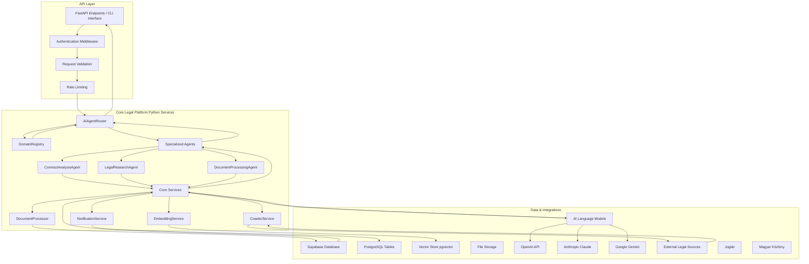
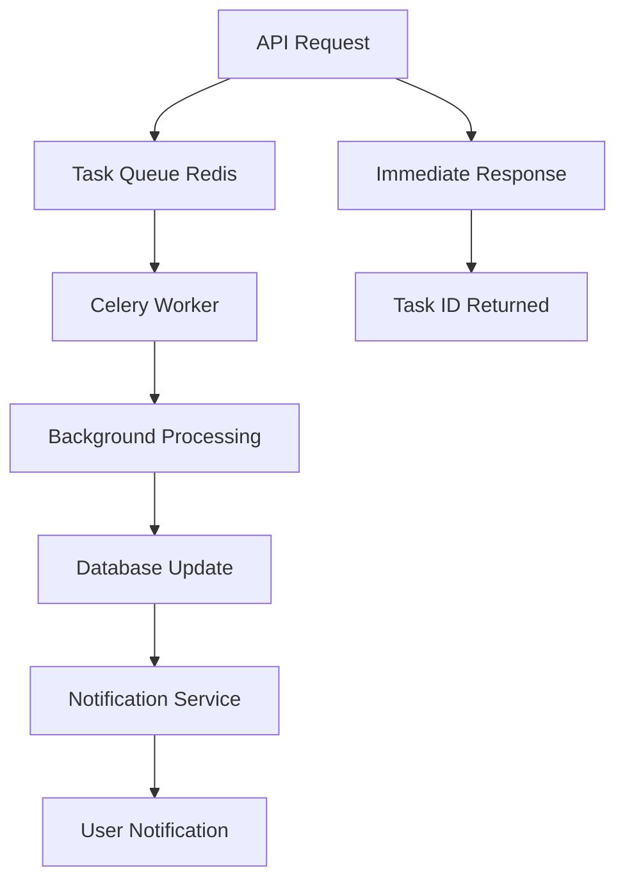

# Data Flow Architecture - Python Backend

This document visualizes how data moves through the Python backend system, from API requests to final responses. The architecture is designed to be a clear, one-way data flow that is easy to trace and debug.

## Data Flow Diagram

The following diagram illustrates the primary path of a user query through the Python backend system.



## Explanation of Data Flow Stages

### 1. **API Request Processing**
The user interacts with the system through:
- **FastAPI REST endpoints** for web applications
- **CLI interface** for direct Python execution
- **Webhook endpoints** for external integrations

```python
# Example FastAPI endpoint
@app.post("/api/v1/analyze/contract")
async def analyze_contract(
    request: ContractAnalysisRequest,
    current_user: User = Depends(get_current_user)
):
    return await ai_agent_router.route_request(request, current_user)
```

### 2. **Authentication & Authorization**
- **JWT Token Validation**: Supabase Auth integration
- **Role-Based Access Control**: User role verification
- **Request Validation**: Pydantic model validation
- **Rate Limiting**: Per-user and per-endpoint limits

```python
# Authentication middleware
async def authenticate_request(request: Request):
    token = request.headers.get("Authorization")
    user = await supabase_auth.verify_token(token)
    return user
```

### 3. **Request Routing**
The `AIAgentRouter` (Python class) serves as the entry point:
- **Domain Context Resolution**: Consults `DomainRegistry` for legal domain information
- **Agent Selection**: Routes requests to appropriate specialized agents
- **Load Balancing**: Distributes requests across available agents

```python
class AIAgentRouter:
    def __init__(self):
        self.domain_registry = DomainRegistry()
        self.agents = {
            'contract_analysis': ContractAnalysisAgent(),
            'legal_research': LegalResearchAgent(),
            'document_processing': DocumentProcessingAgent()
        }
    
    async def route_request(self, request: BaseRequest) -> Response:
        domain_info = await self.domain_registry.get_context(request.query)
        agent = self.select_agent(request.type, domain_info)
        return await agent.process(request)
```

### 4. **Domain Contextualization**
The `DomainRegistry` provides:
- **Legal Domain Mapping**: Hungarian energy law, contract law, etc.
- **Keyword Extraction**: Legal terminology and concepts
- **Context Enhancement**: Domain-specific processing rules

```python
class DomainRegistry:
    async def get_context(self, query: str) -> DomainContext:
        domains = await self.identify_domains(query)
        keywords = await self.extract_keywords(query, domains)
        return DomainContext(domains=domains, keywords=keywords)
```

### 5. **Agent Processing**
Specialized agents handle specific types of legal work:

#### **ContractAnalysisAgent**
```python
class ContractAnalysisAgent:
    async def process(self, request: ContractAnalysisRequest) -> ContractAnalysis:
        # Document preprocessing
        processed_doc = await self.document_processor.process(request.document)
        
        # AI analysis
        analysis = await self.ai_service.analyze_contract(processed_doc)
        
        # Risk assessment
        risks = await self.risk_analyzer.assess(analysis)
        
        return ContractAnalysis(analysis=analysis, risks=risks)
```

#### **LegalResearchAgent**
```python
class LegalResearchAgent:
    async def process(self, request: ResearchRequest) -> ResearchResults:
        # Vector search
        similar_docs = await self.embedding_service.search(request.query)
        
        # Legal source crawling
        fresh_data = await self.crawler_service.search_sources(request.query)
        
        # Synthesis
        results = await self.synthesize_results(similar_docs, fresh_data)
        
        return ResearchResults(results=results)
```

### 6. **Core Service Integration**
Agents utilize shared core services:

#### **DocumentProcessor**
```python
class DocumentProcessor:
    async def process(self, document: Document) -> ProcessedDocument:
        # Text extraction
        text = await self.extract_text(document)
        
        # Legal structure parsing
        structure = await self.parse_legal_structure(text)
        
        # Metadata extraction
        metadata = await self.extract_metadata(text, structure)
        
        return ProcessedDocument(text=text, structure=structure, metadata=metadata)
```

#### **EmbeddingService**
```python
class EmbeddingService:
    async def generate_embeddings(self, text: str) -> List[float]:
        # Use Supabase vector embeddings or external service
        embeddings = await self.embedding_model.encode(text)
        return embeddings
    
    async def search_similar(self, query_embedding: List[float]) -> List[Document]:
        # Vector similarity search using pgvector
        results = await self.supabase.rpc('search_embeddings', {
            'query': query_embedding,
            'limit': 10
        })
        return results
```

### 7. **External System Integration**

#### **Database Operations**
```python
class DatabaseService:
    async def store_analysis(self, analysis: Analysis) -> str:
        result = await self.supabase.table('analyses').insert({
            'user_id': analysis.user_id,
            'document_id': analysis.document_id,
            'result': analysis.result,
            'confidence': analysis.confidence,
            'created_at': 'now()'
        }).execute()
        return result.data[0]['id']
```

#### **AI Model Integration**
```python
class AIService:
    async def call_claude(self, prompt: str) -> str:
        response = await self.anthropic_client.messages.create(
            model="claude-3-5-sonnet-20241022",
            max_tokens=4000,
            messages=[{"role": "user", "content": prompt}]
        )
        return response.content[0].text
```

### 8. **Response Processing**
- **Result Aggregation**: Combine results from multiple sources
- **Response Formatting**: Structure response according to API specification
- **Caching**: Store frequently requested results
- **Audit Logging**: Log all processing steps for compliance

```python
class ResponseProcessor:
    async def format_response(self, raw_result: Any, request_type: str) -> dict:
        if request_type == 'contract_analysis':
            return self.format_contract_analysis(raw_result)
        elif request_type == 'legal_research':
            return self.format_research_results(raw_result)
        # ... other formatters
```

## Asynchronous Processing Flow

For heavy computational tasks, the system uses asynchronous processing:



### Background Task Example
```python
from celery import Celery

celery_app = Celery('legal_ai')

@celery_app.task
async def analyze_large_document(document_id: str, user_id: str):
    # Long-running analysis
    document = await get_document(document_id)
    analysis = await perform_deep_analysis(document)
    
    # Store results
    await store_analysis_results(analysis, document_id, user_id)
    
    # Notify user
    await notify_user_analysis_complete(user_id, document_id)
```

## Error Handling Flow

```python
class ErrorHandler:
    async def handle_exception(self, error: Exception, context: dict) -> ErrorResponse:
        # Log error with context
        logger.error(f"Error in {context['endpoint']}: {str(error)}", 
                    extra=context)
        
        # Determine error type and response
        if isinstance(error, ValidationError):
            return ErrorResponse(
                status_code=400,
                message="Invalid request data",
                details=error.errors()
            )
        elif isinstance(error, AuthenticationError):
            return ErrorResponse(
                status_code=401,
                message="Authentication required"
            )
        # ... other error types
```

## Performance Optimization Patterns

### 1. **Caching Strategy**
```python
# Redis caching for frequent queries
@cache(ttl=3600)  # 1 hour cache
async def get_legal_precedents(query: str) -> List[Precedent]:
    return await search_precedents(query)
```

### 2. **Database Connection Pooling**
```python
# Async database pool
database_pool = create_async_pool(
    database_url=DATABASE_URL,
    min_size=5,
    max_size=20
)
```

### 3. **Concurrent Processing**
```python
import asyncio

async def process_multiple_documents(documents: List[Document]) -> List[Analysis]:
    tasks = [analyze_document(doc) for doc in documents]
    results = await asyncio.gather(*tasks)
    return results
```

---

This data flow architecture ensures efficient, scalable, and maintainable processing of legal queries through the Python backend system, with clear separation of concerns and robust error handling throughout the pipeline.
