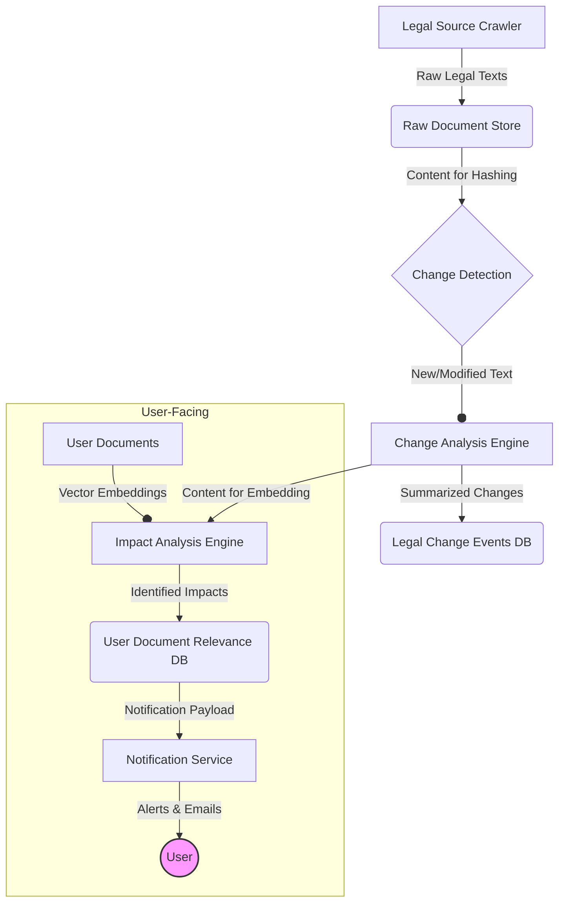

# Proactive Legal Change Detection System

## 1. Overview

This document outlines the architecture for the Proactive Legal Change Detection System. The system's primary goal is to monitor specified Hungarian legal sources, automatically detect changes (amendments, repeals, new legislation), analyze their impact on user documents, and notify relevant users with actionable insights.

## 2. System Components

The system consists of four main components:
1.  **Legal Source Crawler (`DataCollectionAgent`):** A specialized agent responsible for fetching data from legal sources.
2.  **Change Analysis Engine (`ChangeAnalyzer`):** A service that compares different versions of legal texts, identifies specific changes, and summarizes them.
3.  **Impact Analysis Engine:** A component that uses semantic search and vector embeddings to determine which user documents are affected by a detected change.
4.  **Notification System (`NotificationService`):** A service responsible for alerting users about relevant legal changes.

## 3. Architecture and Workflow

### 3.1. Workflow Description

1.  **Crawling:** The `DataCollectionAgent` periodically crawls legal sources (e.g., Magyar Közlöny, Jogtár).
2.  **Change Detection:** For each document, it computes a hash of the content. If the hash differs from the stored version, the document is flagged as modified and sent to the Change Analysis Engine.
3.  **Change Analysis:** The `ChangeAnalyzer` performs a differential analysis (diff) on the text to identify specific insertions, deletions, and modifications. It then uses an LLM to generate a human-readable summary of the change.
4.  **Event Logging:** The summarized change is stored as an event in the `legal_change_events` table.
5.  **Impact Analysis:** The content of the change is vectorized. The system performs a vector similarity search against the indexed user documents to find those that are semantically related to the change.
6.  **Relevance Scoring:** For each potentially impacted document, a relevance score is calculated and stored in the `user_document_relevance` table.
7.  **Notification:** The `NotificationService` queries this table, and for high-relevance events, it generates and sends notifications to the affected users via their preferred channels (in-app, email).

## 4. Database Schema

*   **`legal_change_events`**
    *   `id`: UUID, Primary Key
    *   `source_url`: TEXT, URL of the source document
    *   `change_type`: ENUM ('amendment', 'repeal', 'new_legislation', 'other')
    *   `summary`: TEXT, AI-generated summary of the change
    *   `status`: ENUM ('detected', 'analyzed', 'notified')
    *   `detected_at`: TIMESTAMPTZ
*   **`user_document_relevance`**
    *   `id`: UUID, Primary Key
    *   `user_id`: UUID, Foreign Key to `profiles.id`
    *   `document_id`: UUID, Foreign Key to `legal_documents.id`
    *   `change_event_id`: UUID, Foreign Key to `legal_change_events.id`
    *   `relevance_score`: REAL, score from 0.0 to 1.0
*   **`user_preferences`**
    *   `user_id`: UUID, Primary Key, Foreign Key to `profiles.id`
    *   `notification_channels`: JSONB, e.g., `{"email": true, "in_app": true}`
    *   `notification_frequency`: TEXT, e.g., 'immediate', 'daily_digest'

## 5. Implementation Details

*   **Hashing:** A robust hashing algorithm like SHA-256 will be used for change detection.
*   **Vectorization:** The same embedding model used for the core search functionality will be used for impact analysis.
*   **Notification Templates:** Email and in-app notification templates will be designed to be clear, concise, and actionable. 